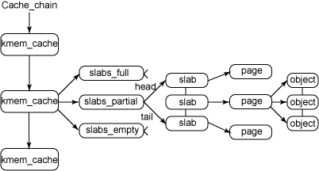

[toc]

# 中断
## 缺页中断的过程详解


## Q&A

# 物理内存管理
## slab分配算法(必看)
[Linux slab分配器剖析(必看)](https://www.ibm.com/developerworks/cn/linux/l-linux-slab-allocator/)
[内存分配[四]-Linux中的Slab(1)](https://zhuanlan.zhihu.com/p/105582468)
slab的五层结构体如图:  


## slob分配算法(slab的简化)

SLOB:Simple List of Blocks(且常与first-fit配合使用)  
[slob: introduce the SLOB allocator(代码)](https://lwn.net/Articles/157944/)  
[SLOB](https://en.wikipedia.org/wiki/SLOB)  
Linux常用的三个内存分配器:`SLUB、SLAB、SLOB`,三者的思路类似,使用场景有所不同[Linux内存分配机制:SLAB/SLUB/SLOB](https://blog.csdn.net/do2jiang/article/details/6423088?utm_medium=distribute.pc_relevant.none-task-blog-baidujs_title-2&spm=1001.2101.3001.4242)  
[Linux Slob分配器(一)--概述(在实现上比较要参考价值)](http://www.linuxidc.com/Linux/2012-07/64107.htm)


## 红黑树
# 线程的实现与调度
## Q&A
- **线程从用户态陷入内核时会切换线程吗(或者说会被阻塞吗)**  
通常来说,是的.系统调用函数很有可能不能马上执行完成(比如IO操作),所以通常会阻塞当前用户线程,直到系统调用完成相关操作后再通知该用户线程.trap.c中trap()函数可印证:  
```
// 如果中断是在用户态发生的
if (!in_kernel) {
    if (current->flags & PF_EXITING) {
        do_exit(-E_KILLED);
    }
    if (current->need_resched) {    // 释放当前线程的cpu,选择新的线程投入执行
        schedule();
    }
}
```